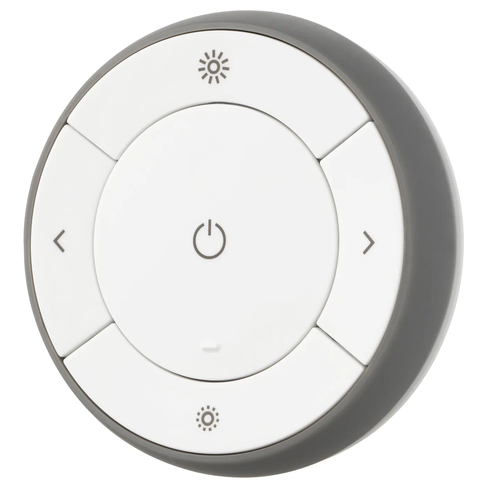

This plugin is the first attempt to add native zigbee support to nymea. The plugin depends on the 
[libnymea-zigbee](https://github.com/nymea/nymea-zigbee) which contains the stack implementation.

Following features are currently available:

* Add in the supported UART Hardware as a gateway and give control over the network
* Starting a Zigbee Network using the NXP JN5168/JN5169
* Permit devices to join the network
* Remove devices from the network
* Control the supported devices from this plugin

Follwoing features are planed:

* Provide generic classes for standardized Device Types like power sockets and different lights
* Add group and group management support
* Add scenes and scenes management support
* Manage bindings within the network
* Support different Zigbee Gateway Hardware
* Receive Zigbee Lightlink commands within nymea

# The network controller

Depending on your zigbee gateway hardware the controller can be added by discovery into nymea. During the setup the type of the stack can be specified.
Currently only the NXP stack is supported.

Once the Zigbee Controller has been added successfully, the network will be initialized automatically and started.

# Lumi / Xiamo / Aquara devices

## Aquara temperature and humidity sensor

> Note: this device does not support direct measurement reading, which means you get the values only when the device decides to send a value changed notification. This is out of spec.

You can find the device description [here](https://www.aqara.com/us/temperature_humidity_sensor.html).

### Adding the device to into nymea

1. Allow devices to join the network in the network controller (enable `Permit join`)
2. Press the button on the device for 5 seconds until the LED starts blinking
3. Wait for the device to appear in nymea. This can take up to 30 seconds.

## Aquara Motion sensor

> Note: this device does not support direct measurement reading, which means you get the values only when the device decides to send a value changed notification. This is out of spec.

You can find the device description [here](https://www.aqara.com/us/motion_sensor.html).

### Adding the device to into nymea

1. Allow devices to join the network in the network controller (enable `Permit join`)
2. Press the button on the device for 5 seconds until the LED starts blinking
3. Wait for the device to appear in nymea. This can take up to 30 seconds.

## Aqara Door and Window Sensor

> Note: this device does not support direct measurement reading, which means you get the values only when the device decides to send a value changed notification. This is out of spec.

You can find the device description [here](https://www.aqara.com/us/door_and_window_sensor.html).

### Adding the device to into nymea

1. Allow devices to join the network in the network controller (enable `Permit join`)
2. Press the button on the device for 5 seconds until the LED starts blinking
3. Wait for the device to appear in nymea. This can take up to 30 seconds.

## Aqara water leak sensor

> Note: this device does not support direct measurement reading, which means you get the values only when the device decides to send a value changed notification. This is out of spec.

You can find the device description [here](https://www.aqara.com/us/water_leak_sensor.html).

### Adding the device to into nymea

1. Allow devices to join the network in the network controller (enable `Permit join`)
2. Press the button on the device for 5 seconds until the LED starts blinking
3. Wait for the device to appear in nymea. This can take up to 30 seconds.

## Aqara button

> Note: this device does not support direct measurement reading, which means you get the values only when the device decides to send a value changed notification. This is out of spec.

> Note: some devices react only on the button released. Those devices do not support the long pressed event.

You can find the device description [here](https://www.aqara.com/us/wireless_mini_switch.html).

### Adding the device to into nymea

1. Allow devices to join the network in the network controller (enable `Permit join`)
2. Press the button on the device for 5 seconds until the LED starts blinking
3. Wait for the device to appear in nymea. This can take up to 30 seconds.

# Ikea TRÅDFRI

## TRÅDFRI remote

# Lumi / Xiaomi / Aquara

# FeiBit

